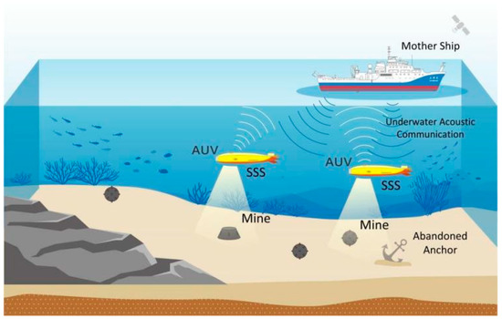

<h1 style="blue">🚀 Submarine Rock vs Mine Prediction</h1>
This project uses machine learning techniques to classify whether an object detected by a submarine's sonar signal is a rock or a mine. The goal is to enhance underwater object identification, aiding in navigation and safety operations.

🧠 Project Objective
To build a reliable binary classification model that can predict whether the object below the submarine is a mine (dangerous) or a rock (safe), using sonar signal data as input.

📊 Dataset
The dataset contains sonar returns collected by bouncing sound waves off different objects in the water. Each row in the dataset represents a single sonar signal, with numeric features corresponding to energy levels at different frequencies. The target label indicates:

R: Rock

M: Mine

🔍 Techniques Used
Data Preprocessing:
Model Training: Supervised learning algorithms like:
Logistic Regression
Random Forest
Evaluation: Accuracy, Confusion Matrix, Precision
⚙️ Hyperparameter Optimization with Optuna

🧪 Results
The model was trained and validated using techniques such as k-fold cross-validation to ensure robustness and avoid overfitting. The final model achieved high accuracy and generalizes well on unseen sonar data.

📌 Applications
This model can be used in:

Submarine Navigation Systems

Defense and Naval Operations

Autonomous Underwater Vehicles (AUVs)

